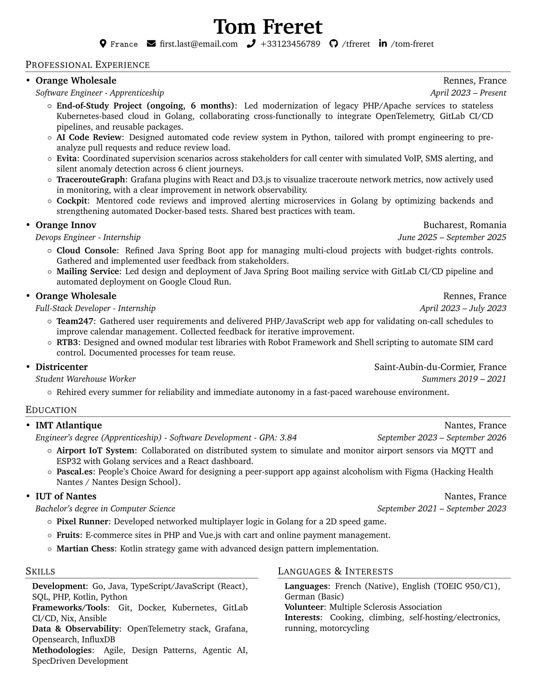

# Personal Resume (English & French)

This repository contains my personal resume, one version in English another one in French.

## Features

- Clean, professional design inspired by others CV templates
- FontAwesome icons for contact informations
- Sections and resume items generic functions

## Preview



## How to Use

### Customizing Content

Simply edit each file (`cv_en.tex` and `cv_fr.tex`) to replace the placeholder information with your own details:

1. Update your contact information at the top
2. Fill in your education details
3. Add your work experience
4. List your skills and competencies
5. Include your projects

### Compilation

These templates are designed to be compiled with nix and texlive:

```bash
nix build
```

## Credits

Inspired by multiple open-source LaTeX CV templates:
- [harshibar/resume](https://github.com/harshibar/resume)
- [jakegut/resume](https://github.com/jakegut/resume)
- [sb2nov/resume](https://github.com/sb2nov/resume)